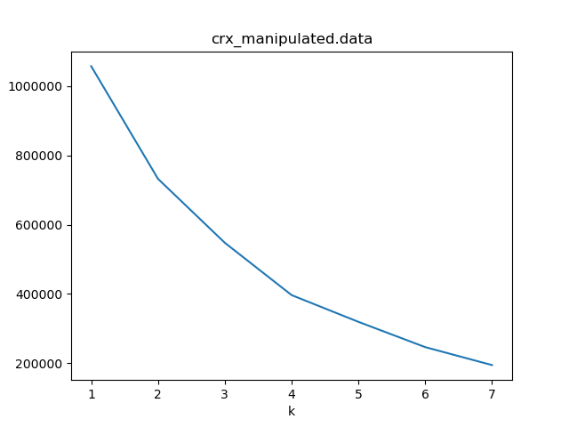
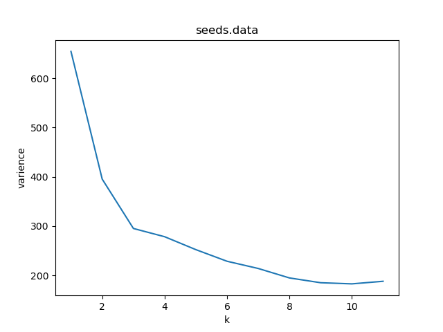

## Data Mining Lab 3
### Abdullah Al Thaki
### Roll: 12
---

#### Introduction

K-means and K-medoids are two well known clustering algorithm for unsupervised setting. K-means clustering uses mean as the centroid while K-medoid clustering uses medoid as the centroid. Even though K-means clustering is faster than K-medoids, K-medoids doesn't have outlier problems. Here I have experimented these clustering methods on several real life datasets.

#### Precision bcubed

#### Recall bcubed

#### Varience

#### Silhouette

#### Elbow method

Elbow method is used to find out best k. I have manipulated Kmeans clustering algorithm to show elbow method.

#### Findings

From elbow method, the real k is not very intuitive all the time. However elbow method can give us some hint. Kmeans takes very less time compare to Kmedoids. Kmeans has very low implementation complexity. But Kmedoids can give better result compared to Kmeans.

In the four evaluation metric, there is no exclusive winner. Kmeans have done well in some cases, Kmedoids have done well in others. However the result could be different in some other real life huge/complex dataset.